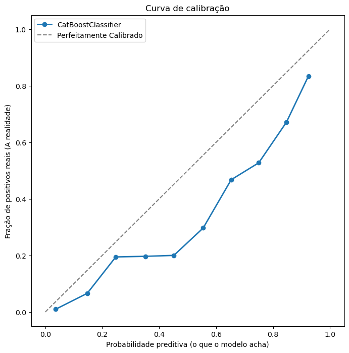
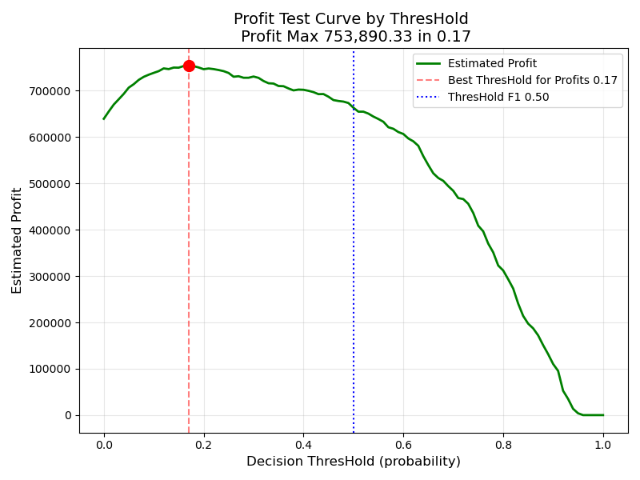
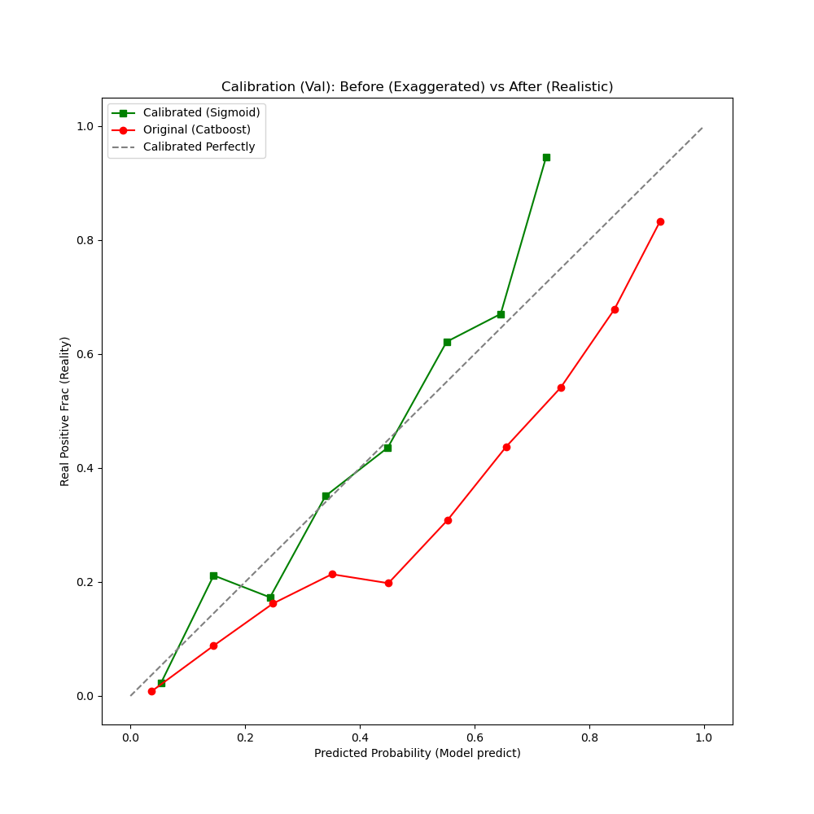
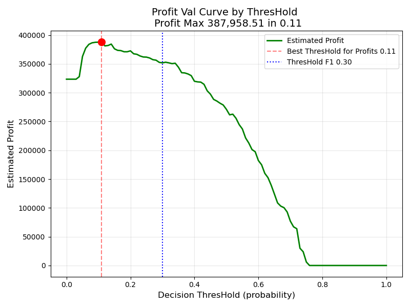

# 🚜 Classificação de Clientes que darão Churn (Catboost)


## 📋 Sobre o Projeto
Este projeto resolve um problema muito comum em toda e qualquer empresa: Churn de clientes.

O principal desafio neste caso/projeto é conseguir entender as oscilações do comportamento humano, para assim conseguir traçar um padrão de perfil de usuários que da churn.

## 📋 Entendimento de negócios.
Realizando EDA pode-se concluir alguns padrões que ajudam a basear a classifição de Churn para tal Cliente.
Clientes mais propensos a churn utilizam menos produtos que clientes menos propensos.

## 🧠 Estratégia de Modelagem

### 1. Algoritmo escolhido e Paramêtros
Utilizei o **Catboost Classifier** com a função hiperparametros como **Learning Rate** (`0.01`) e **Class_Weight** (`balanced`).
* **Por que o Catboost venceu XGB, LGBM e RF?** Geralmente modelos boosting (XGB E LGBM) se sobressaem em analises preditivas, porém neste case, o Catboost se sobressaiu por conta de uma característica que ele possui. Trato com variáveis categoricas. Por conta deste dataset ser majoritariamente formado por variáveis categóricas, ele acaba sendo o tipo de base perfeita para o Catboost performar, que foi o que ocorreu nessa rodada de treinos.
* **Por que Learning Rate e Class_Weight?** Por que no caso de análise de churns o mais díficil é aprender o padrão de comportamento numa base tão desbalanceada, e neste caso, a melhor solução é fazer que o modelo se atende a todo e qualquer detalhe no treinamento, fazendo com que o modelo não passe por um comportamento ou indicio de possível churn sem detectá-la. Em conjunto com ele, o paramêtro class_weight ajuda muito dizendo para o modelo dar mais enfoque na classe minoritária (aumenta o peso da classe churn e ajuda o modelo a "ter medo" de perder possíveis clientes churners).

### 2. Engenharia de Features
A estrutura de dados foi construída com `Scikit-Learn` incluindo:
* **Scaling:** do **"Total Charges"** e das features numéricas para menores escalas.
* **Imputer:** da mediana em features numéricas com missings e valores constantes em features categóricas.
* **Enconding:** em features catégoricas.
* **Limpeza e Transformação:** na feature **"Total Charges"** por conta de registro de espaço na coluna.


## 📊 Resultados (Teste baseline Pré calibração com Threshold)

| Métricas | Valor Final |
|----------|-------------|
| **Threshold** | **0.50** (Calibrador de probabilidades padrão do modelo) |
| **Precision** | **55%** (Assertividade percentual dos apontamentos de fraude) |
| **Recall**    | **79%** (Capacidade de detecção) |
| **F1-Score**  | **65%** (Equilíbrio entre Precision x Recall) |
| **ROC AUC**   | **78%** (Capacidade de separação entre Churn e Não churn) |

### Performance Teste: Curva de Calibração Padrão
> *O gráfico linha abaixo mostra como se comportou o modelo durante o teste, e sua performance de calibração comparada ao modelo perfeito*



### Performance Financeira Teste
> *O gráfico de barras abaixo mostra o resultado financeiro do modelo no Teste.
Entregando um valor de **$753 Mil** dolares de churns evitados, que equivalem a **36%** do valor total movimentado pelos clientes na base teste (com Threshold ótimo de lucro para a base teste em 0.17 e Threshold ótimo para o modelo em 0.5)*



## 📊 Resultados (Validação com Threshold)

| Métricas | Valor Final |
|----------|-------------|
| **Threshold** | **0.30** (Calibrador ótimo de probabilidades da base de validação) |
| **Precision** | **69%** (Assertividade percentual dos apontamentos de fraude) |
| **Recall**    | **61%** (Capacidade de detecção) |
| **F1-Score**  | **65%** (Equilíbrio entre Precision x Recall) |
| **ROC AUC**   | **81%** (Capacidade de separação entre Churn e Não churn) |


### Performance Calibrada: Curva de Calibração
> *O gráfico linha abaixo mostra como se comportou o modelo durante a validação com o threshold perfeito definido, e sua performance de calibração comparada ao modelo de teste e o modelo perfeito*




### Performance Financeira Calibrada
> *O gráfico de barras abaixo mostra o resultado financeiro do modelo na validação.
Entregando um valor de **$388 Mil** dolares de churns evitados, que equivalem a **37%** do valor total movimentado pelos clientes na base de validação (com Threshold ótimo de lucro para a base de validação em 0.11 e Threshold ótimo para o modelo em 0.3)*




## Conclusão e Recomendação de Negócio
**A escolha do ponto de operação do modelo depende da estratégia momentânea da empresa, apresentando dois cenários distintos:**
* **1. Estratégia de "Proteção Agressiva" (Threshold 0.11):** 
   * **Foco:** Maximizar a retenção financeira a qualquer custo (Lucro Líquido Estimado: Máximo).
   
   * **Cenário ideal:** Campanhas de baixo custo operacional (ex: E-mail automatizado, SMS, Push Notification) onde o custo de um "Falso Positivo" é irrisório.
   
   * **Risco:** Abordar uma grande parcela da base, gerando possíveis descontos desnecessários (canibalização) para clientes que não sairiam.
* **2. Estratégia "Cirúrgica / Eficiência Operacional" (Threshold 0.30):** 
   * **Foco:** Equilíbrio entre recuperação de receita e precisão da equipe (Melhor F1-Score).
s
   * **Cenário ideal:** Ações de alto custo (ex: Ligação de Gerente de Conta, Retenção ativa via Call Center) onde o tempo da equipe é limitado.
   
   * **Vantagem:** Evita o desgaste da base de clientes fiéis e garante que cada contato tenha uma alta probabilidade de conversão.

* **Recomendação Final:** Considerando que o custo de retenção simulado foi baixo (5% da média do LTV), recomenda-se iniciar com uma abordagem híbrida (ex: Threshold 0.20), monitorando a taxa de conversão da equipe de retenção e ajustando a régua conforme a capacidade operacional.

## 🚀 Como Rodar o Projeto

1. **Clone o repositório:**
   ```bash
   git clone [git@github.com:savioricardog/churn-predict.git](https://github.com/savioricardog/churn-predict.git)

2. **Instale as dependências:**
   ```bash 
   pip install -r requirements.txt

3. **Execute o arquivos :**
   ```bash 
   python src/train_pipeline.py

## 📂 Estrutura de Arquivos 

* **churn-predict.py:** Estrutura principal de treinamento.

* **churn-predict.ipynb:** Arquivo em modelo Jupyter.

* **requirements.txt:** Dependências do ambiente.

* **model:**
   * **import MlFlow**
   * **Carregar o modelo diretamente do MLFlow:**
      * mlflow.set_tracking_uri("http://seu-servidor-mlflow:5000")
      * versions = mlflow.search_model_versions(filter_string= "name = 'model_churn'") 
      * last_version = max([int(i.version) for i in versions])
      * model = mlflow.sklearn.load_model(f"models:///model_churn/{last_version}")
      * predictions = model.predict(data)

**Desenvolvido por Savio Ricardo Garcia 👨‍💻**
